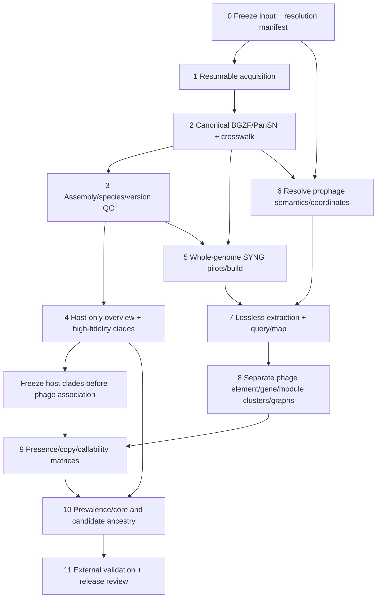

# Evidence-based execution plan for the *E. coli* host/prophage pangenome

**Plan status:** design only; production is **not authorized**.  This integration did not download, rename, compress, index, query, compare, cluster, or build any production genome, graph, distance matrix, tree, or pangenome.  It depends on all five completed upstream tasks and adopts only their bounded findings.

## 1. Verdict and evidence convention

The conceptual workflow is sound if it is implemented as three linked but non-interchangeable analyses:

1. a versioned host-genome collection and host-only population structure;
2. a whole-genome coordinate/query representation; and
3. separate prophage element/gene/module clustering, presence inference, and cautious ancestral-state analysis.

Four corrections are essential.  The installed executable is **IMPG 0.4.1**, with an embedded **SYNG backend**, not a program called “IMPG-SYNG,” “INPG,” or “INFG” [I §1, “Terminology resolution”].  “Mesh distance/triangle” should be **Mash distance/triangle**; Mash was not installed, and a Mash+NJ result is an unrooted genomic-similarity dendrogram, not by itself an organismal phylogeny [H §1; H §2].  The source table does not define “tagged”; `transposable=1.0` and `taxonomy!=Unknown` are different, explicitly named analysis scopes [P §“Headline result and the meaning of tagged”].  Finally, prevalence/core membership is not ancestry: ancestry requires a frozen, uncertain host tree, explicit gain/loss/HGT and detection models, and independent sequence/synteny evidence [H §8].

A sensible initial architecture is **one logical, release-specific whole-cohort SYNG prefix (six inseparable files)** for indexed host paths, plus **zero or multiple cluster-specific prophage graphs** as biology requires.  It is a hypothesis to test, not a 26,077-assembly feasibility conclusion: the installed SYNG builder has no merge or build-resume operation and its exact full-scale RAM, time, disk, and query behavior are unknown [I §4; I §5; I §6].

### Citation keys

Every adopted or rejected upstream finding below cites a report and a specific section:

- **[S]** [`storage_and_acquisition.md`](storage_and_acquisition.md)
- **[P]** [`prophage_distribution.md`](prophage_distribution.md)
- **[I]** [`impg_syng_assessment.md`](impg_syng_assessment.md)
- **[H]** [`phylogeny_design.md`](phylogeny_design.md)
- **[N]** [`pansn_bgzip_naming.md`](pansn_bgzip_naming.md)

Machine-readable evidence remains owned upstream; this plan does not copy or alter it. The integration consumed these contracts rather than re-running them:

| Upstream machine-readable artifact | Integrated use |
|---|---|
| `../artifacts/genome_input_inventory.tsv`, `genome_acquisition_estimate.tsv` | exact occurrence/resolution ledger and non-double-counted capacity rows [S §“Input inventory”; §“Capacity and transfer model”] |
| `../artifacts/prophage_summary/per_genome.tsv`, `summary_metrics.tsv`, `category_counts.tsv`, `interval_qc.tsv` | denominator-bearing scopes, anomalies, exact source-row/locus handoff [P §“Machine-readable outputs and plots”] |
| `../artifacts/pansn_identifier_crosswalk_template.tsv` and `pansn_bgzip_probe/synthetic/results/status_matrix.tsv` | upstream 96-column lossless identity precedent and narrow BGZF/`#` compatibility evidence [N §4; §6] |
| `../artifacts/impg_probe/{version.txt,help.txt,synthetic/probe.log}` | installed identity, CLI boundaries and tiny deterministic plumbing—not a scale estimate [I §1; §7] |
| `../artifacts/phylogeny_probe/{tool_versions.txt,commands.sh}` | proof that Mash-family tools were absent and that no sequence probe ran [H §1] |

## 2. User-question-to-evidence coverage matrix

| User question | Evidence owner and section | Adopted answer/evidence | Unresolved decision / gate |
|---|---|---|---|
| What are the accessions, their quality/status, and are genomes already present? | `storage-genome-acquisition-inventory`: [S §“Input inventory”; §“Bounded existing-data search”] | 26,078 physical, nonblank, unique tokens comprise 26,077 exact versioned `GCF_` RefSeq assembly accessions and one malformed terminal `genome`; all 26,077 were recognized by NCBI `/genome/check` on 2026-07-24. The bounded search found zero exact reusable filename hits. | Recognition is not a frozen status/quality snapshot; refresh exact versions/status/annotations. The bounded search cannot prove absence outside its scope. QC metrics require payloads/metadata and a pilot.
| Where can data live, and how large are transfer, expanded, durable, intermediate, and backup footprints? | `storage-genome-acquisition-inventory`: [S §“Filesystem evidence”; §“Capacity and transfer model”; §“Guardrails and layout”] | Candidate durable root is `/home/erikg/phind-data/ecoli26k/v1`; moveable compute scratch is `/mnt/nvme3n1/erikg/phind-genome-work/ecoli26k/v1`; same-host checksum replica is on NVMe2. Acquisition envelope is 116/186/392 GB low/central/high including primary, replica, acquisition scratch/staging, and 25% margin. Whole-set plain FASTA (122/138/153 GB) is excluded. | Recheck live `df/findmnt` and obtain allocations. SYNG/tree/phage compute remains a separate measured 0.5/2/8-TB scenario, not a promise. Expanded annotation beyond retained compressed GFF3 is unestimated.
| How is acquisition resumable? | `storage-genome-acquisition-inventory`: [S §“Later acquisition and resume procedure”] | Freeze input bytes; resolve exact versions; deterministic chunks; `.partial` plus remote identity; validate archive/MD5 and local SHA-256; append-only states; atomically commit one assembly directory; skip only a fully revalidated commit. | Pin NCBI Datasets/client and chunk limits in the pilot. Compression itself restarts rather than appends.
| What is the canonical BGZF layout, checksum model, and index contract? | `pansn-bgzip-genome-layout`: [N §5.1–5.4; §7]; storage cross-check [S §“Capacity and transfer model”] | One `<pansn_sample>.pansn.fa.gz` per assembly with appended `.fai` and `.gzi`; deterministic LF/uppercase/60-base wrapping; distinct source, decompressed, canonical-content, compressed, sequence, FAI, and GZI digests; same-filesystem staging and a last `COMPLETE` marker/directory rename. | Pin compressor build/parameters. Compressed SHA is artifact identity, not biological identity. A tool-specific plain view is ephemeral, checksummed, quota-bounded, and deleted.
| What are normative PanSN fields and stable strain/accession rules? | `pansn-bgzip-genome-layout`: [N §2; §3] | Published core is `sample#haplotype#contig`. Project policy uses exact resolved versioned assembly accession as sample, `1` for nominally haploid assemblies, and reversibly encoded source FASTA token as contig. Strain/BioSample are metadata, not identity; assembly revisions never overwrite each other. | Locally sourced assemblies need the documented digest fallback. Every new consumer must pass literal-`#` tests.
| How are identifiers and coordinates joined losslessly, and which tools need transformations? | `pansn-bgzip-genome-layout`: [N §4; §6]; table audit [P §“Lossless current-key crosswalk requirements”]; IMPG contract [I §3; §8] | Preserve input occurrence, exact assembly/scaffold versions and raw bytes, FASTA/GFF aliases, raw coordinate text, source row and file digest, canonical PanSN name, 0-based half-open intervals only after convention resolution, strand/topology/edge flags, and all artifact digests. | Current prophage convention and strand are unresolved; do not extract until resolved. GFF lexical `%23` versus FASTA `#` and all untested tool boundaries require staged transformations or alias tables.
| What is the observed all/tagged prophage distribution, including zero/multiple genomes and anomalies? | `prophage-table-distribution`: [P §“Headline result”; §“Coordinates…QC”; §“Likely artifacts and limits”] | All: 132,404 unique loci; zero/one/multiple genomes 0/1,200/24,877. `transposable=1.0`: 7,695 loci; 20,435/4,446/1,196. Taxonomy-assigned: 115,442 loci; 171/1,790/24,116. There are 12,279 begin≤3, 817 <1 kb, one >200 kb, and no exact overlap/nesting pairs. | “Tagged” remains a user decision; run all named scopes. Edge/length flags are not completeness labels. All-record zero prevalence is not independent because list/table are coextensive.
| What is installed, and what do IMPG/SYNG mean and support? | `impg-syng-capability`: [I §1; §2; §7] | Installed `impg 0.4.1` SHA-256 `509296…a94285f`; alignment-backed IMPG and FASTA/AGC-backed SYNG are alternative backends. SYNG stores syncmer paths/sidecars, not all sequence bases. Tiny ordinary build/query/map worked. | Exact installed source commit is unrecoverable. Full-scale behavior, ambiguity effects, boundary refinement, and many I/O boundaries remain unknown.
| One graph/index or several? | `impg-syng-capability`: [I §4; §5; §6] | Pilot one release-specific whole-cohort SYNG logical prefix. Reuse it for coordinate query and sequence map. Do not duplicate it merely for matrix construction. Build optional graph(s) per validated prophage cluster/module; unrelated phages need not share a graph. | A cohort aggregation/AGC boundary and 26k build must pass pilots. Shards are a fallback query federation, not a merge-equivalent single index. Alignment-backed IMPG is an explicit alternative, not a mandatory second layer.
| How does whole genome → prophage query → core/accessory work? | `impg-syng-capability`: [I §2 “Query versus map”; §4]; table/crosswalk [P §“Lossless…”] | Convert validated source loci to BED-like 0-based half-open intervals and use `impg query -b`; map extracted/novel sequences with `impg map`; independently validate hits; cluster elements/genes/modules externally; aggregate sample×cluster calls as present/absent/uncallable and copy count. | IMPG does not create biological clusters or the matrix. Presence thresholds, query merge distance, homology, clustering, and callable rules require held-out controls.
| Are Mash distance/triangle scalable and defensible? | `mash-phylogeny-design`: [H §1–3; §5] | Exact all-pair counts are 287,988,000 (24k) and 337,987,000 (26k). A staged Mash v2.3 `k=21,s=10k` candidate plus RapidNJ can yield a coarse unrooted dendrogram if gates pass. MashTree is not the 26k default. | Mash/RapidNJ are not installed. Fill actual runtime/RAM/I/O allocations; otherwise use a representative tree plus all-host assignment. Do not call Mash+NJ a resolved phylogeny.
| Keep all genomes or representatives? | `mash-phylogeny-design`: [H §4.5; §6; §9] | QC, identity ledger, sketching/placement, and prevalence keep all eligible biological hosts. Exact duplicates remain aliases; high-fidelity recombination-filtered trees use host-genetic medoids, boundaries, and diverse representatives. All non-representatives retain explicit membership/ambiguity. | Full all-host Mash triangle is conditional. Deduplication unit (assembly versus biological isolate) must be frozen before prevalence.
| How are host clades separated from prophage networks? | `mash-phylogeny-design`: [H §7; §8] | Define/freeze host clades from host-only core evidence before joining phage traits. Keep host core trees separate from phage gene-content networks, module/synteny graphs, and marker trees. | Unsupported clades become polytomies/alternative partitions; no phage feature may select the preferred host partition.
| How do prevalence, conserved/core components, and candidate ancestry differ? | `mash-phylogeny-design`: [H §8]; IMPG limitation [I §4] | Prevalence is an observed callable-host proportion; core/soft-core are declared prevalence classes of homologous units; conserved adds sequence/domain/synteny evidence. Candidate ancestry is a model-dependent historical hypothesis robust to host trees, HGT/loss/detection and external references. | No ancestral phage or universal threshold is established by upstream data. Threshold/model/reference choices remain preregistered pilot decisions.

## 3. Decisions, contradictions, and explicit unknowns

| ID | Decision now | Evidence and reconciliation | Reopen when |
|---|---|---|---|
| D1 | Collection cardinality is 26,077 candidate assemblies, not 26,078. Quarantine `genome`. | Exact inventory [S §“Integrity and reconciliation”]. | A new immutable input release is approved.
| D2 | Exact accession.version is the assembly/PanSN sample identity; never strain, BioSample, versionless accession, or “latest.” | [N §3.1]; current version stripping happens to cause no collisions but is diagnostic only [P §“Row…reconciliation”]. | A non-NCBI local assembly invokes the digest fallback.
| D3 | Root may hold the hundreds-of-GB durable acquisition under hard floors; it is not general compute authorization. | Live observation and 392-GB high envelope [S §“Scope and decision”; §“Guardrails”] versus unmeasured 0.5–8-TB compute [S §“Capacity…”]. | Rechecked allocation or measured pilot requires migration.
| D4 | Preserve all records plus two named subsets; never label either subset generically “tagged.” | No tag/completeness field [P §“Headline result”; §“Schema and semantic evidence”]. | Producer documentation defines a filter.
| D5 | Prophage coordinates stay `UNRESOLVED`; `end-begin+1` is descriptive sensitivity only. | Minimum begin=1 is consistent with, but does not prove, 1-based closed; lengths/strand/topology absent [P §“Coordinates…”; N §4.3]. | Producer documentation or known-base sentinel establishes convention and strand behavior.
| D6 | Canonical per-assembly BGZF/PanSN is immutable; tool views are derived. | Canonical policy [N §5]. | A policy-versioned release is created; old release remains immutable.
| D7 | Direct BGZF/`#` support is claimed only for tested boundaries. | samtools, wfmash and narrow IMPG build/map passed; classic Mash/graph/gene tools did not [N §6.2; I §8]. | Exact selected version passes the synthetic and real pilot.
| D8 | Primary whole-genome hypothesis: one all-eligible-cohort SYNG prefix; separate phage graphs as needed. | Backend and stage separation [I §2; §4]. This is not proof at 26k [I §6]. | Scale/aggregation gate fails; choose shards or an alignment backend with an explicit output-federation contract.
| D9 | Host analysis uses both all genomes and representatives, for different stages. | All-host ledger/placement with representative high-resolution trees [H §4.5; §6]. | Pilot shows an all-host high-resolution route fits and is scientifically justified.
| D10 | Do not infer ancestry from high prevalence or host monophyly alone. | Host/phage histories differ and HGT/loss/detection can mimic patterns [H §8]. | Never; only strengthen a candidate with explicit models and validation.
| D11 | Installed IMPG artifact identity is its binary digest; do not assign it the current source checkout SHA. | Binary lacks embedded SHA and predates checkout [I §1 “Installed evidence”]. | Rebuild reproducibly from a pinned source/container.
| D12 | Taxonomy strings are source labels, not validated modern viral taxonomy or element quality. | Classifier/version/confidence are absent and mixed labels exist [P §“Schema and semantic evidence”; §“Contig/scaffold and category distributions”]. | Source method is recovered and externally validated.

## 4. Canonical identity, coordinates, and lossless joins

### 4.1 Identifier hierarchy

The project-wide flat example schema is `../artifacts/project_manifest_template.tsv`. Its 162-column header is normative; dots are nulls. A production generator must reject every `record_status=EXAMPLE` row. The example values intentionally use `EXAMPLE_…`, including non-digest checksum placeholders, so they cannot be mistaken for observations.

Header dictionary:

| Column group | Contract |
|---|---|
| `schema_version` through `source_task_id` | schema/status/type, stable row/parent keys, release/run and owning provenance |
| `input_source_file` through `duplicate_group` | immutable input bytes, physical occurrence, raw Base64 line, normalized token and duplicate accounting |
| `resolution_status` through `assembly_qc_reason` | requested/resolved/paired/superseded assembly revisions, assembly/analysis-unit IDs, independence, representative and QC decisions |
| `source_url` through `source_gff_sha256` | retrieval identity/time, source blob/content and annotation locations, sizes and digests |
| `pansn_policy_version` through `pansn_sequence_name` | sample/haplotype bases, raw FASTA header/token, contig aliases, reversible encoding and full PanSN identity |
| `fasta_seqid` through `contig_sequence_sha256` | exact FASTA ID, replicon metadata/topology/length and wrapping-independent sequence digest |
| `canonical_bgzf_relpath` through `object_state` | BGZF/content/FAI/GZI paths, sizes and distinct digests, last completeness marker and lifecycle state |
| `source_gff_row` through `canonical_gff_seqid_decoded` | original lexical/decoded GFF seqid and canonical `%23` lexical versus `#` semantic forms |
| `prophage_source_file` through `taxonomy_assigned_scope_member` | source-file/row/raw identifiers, composite locus key, stable locus ID and all three explicit source scopes |
| `source_coordinate_convention` through `locus_callability` | raw and parsed source coordinates/strand, policy-versioned half-open intervals, circularity/edge and callability state |
| `extraction_id` through `exact_source_sequence_verified` | extraction identity, orientation, length/content digest and exact-source verification |
| `host_tip_id` through `host_clade_membership_status` | host tree, representative/placement and immutable clade-release joins |
| `impg_release_id` through `query_result_partition_id` | backend/prefix, sample/path, release-scoped node walk and batched query evidence; node scope prevents numeric-node reuse |
| `cluster_release_id` through `cluster_graph_relpath` | unit type, frozen membership/representative and optional cluster-graph release |
| `matrix_release_id` through `matrix_evidence_ids` | analysis-unit×cluster state, copy count, callability reason and supporting evidence |
| `software_name` through `row_sha256` | executable/config identity, seed/threads, attempt/retry/times, artifact state, extensible provenance and row integrity |

| Object | Canonical key and version rule | Required lossless links |
|---|---|---|
| Input occurrence | `input_occurrence_id`; deterministic from immutable input-file digest, physical line number, and raw-line bytes | raw Base64 line, exact LF policy, normalized token, duplicate group, resolution record
| Assembly revision | `assembly_id = resolved_assembly_accession_version = pansn_sample` for NCBI records | requested/resolved/paired/superseded accession, status, metadata snapshot, sequence artifact, BioSample/strain as non-ID metadata
| Canonical assembly file | `assembly_id + canonical_policy_version`; relative path `objects/<shard>/<assembly_id>/<assembly_id>.pansn.fa.gz` | BGZF, `.fai`, `.gzi`, `COMPLETE`, content/compressed/index checksums, bytes, tool/run IDs
| Source contig | `(assembly_id, source_fasta_id_token_b64)` plus aliases; never version-stripped | full defline, raw token, GFF lexical/decoded seqids, GenBank/RefSeq aliases, length, topology, role, sequence digest
| PanSN path | `pansn_sequence_name = pansn_sample#pansn_haplotype#pansn_contig`; normally `assembly#1#source_token` after reversible encoding | exact source contig row; `fasta_seqid`, `impg_path_id`, and pangenome path; two literal `#` delimiters [N §3]
| Prophage source row | `prophage_row_id = (source_file_sha256, physical_source_row)` and raw source `prophage_id` | exact genome/scaffold/begin/end strings; composite locus digest; subset flags; caller/method fields if recovered
| Canonical locus | `prophage_locus_id`, a domain-separated digest of assembly revision, source-contig identity, canonical ordered interval JSON, strand state, assembly sequence digest, and coordinate-policy version | source row(s), PanSN path, interval convention, wrap/edge/incomplete flags
| Extraction | `extraction_id`, versioned digest of locus, exact assembly content digest, interval JSON, orientation policy, and extraction tool/run | extracted FASTA record, sequence digest/length, source-spelling verification, no implicit strand guess
| Host-tree tip | `host_tip_id = assembly_id` for assembly-level analyses; biological-isolate grouping is a separate `analysis_unit_id` | sequence checksum, representative ID, placement/clade release, ambiguity and QC status
| IMPG object | `impg_release_id` identifies the six-file prefix; paths join by exact `pansn_sequence_name` | build manifest and parameters; **numeric syncmer node IDs are not stable join keys** across modes/releases [I §5 “Determinism”]
| Phage cluster/module | `cluster_id` names a frozen clustering release and membership digest, not an eternal biological family | unit type (element/gene/domain/module), representative, method/thresholds, members, optional graph release
| Matrix cell | `(matrix_release_id, analysis_unit_id, cluster_id)` | `present|absent|uncallable|ambiguous`, copy count, evidence IDs, callable denominator rule, threshold release

All joins are case-sensitive and version-preserving. A human label may be displayed but never substituted. No ordinal IMPG node, cluster number from an unfrozen run, versionless accession, or file basename alone is an authoritative join.

### 4.2 Coordinate/extraction contract

1. Preserve raw begin/end strings and integer parses. Do not normalize while `source_coordinate_convention=UNRESOLVED` [P §“Coordinates…”].
2. Once independently resolved, convert exactly once into **0-based half-open** `[start,end)`. A documented 1-based closed `[b,e]` becomes `[b-1,e)` [N §4.3; I §3]. Validate `0 ≤ start < end ≤ contig_length`.
3. Preserve `source_strand`. The current CSV has none, so canonical strand is `unknown`; do not infer it [P §“Schema…”]. For unknown strand, emit serialized forward-contig spelling and mark orientation unknown. For an authoritative `-`, reverse-complement only the oriented derivative while retaining the forward genomic extraction and both digests.
4. Preserve contig rotation/topology. A circular origin-crossing locus is ordered intervals `[[start,L],[0,end]]`; concatenate in that order, set `wraps_origin=true`, and never rotate the canonical contig [N §4.3].
5. Record `touches_left_boundary`, `touches_right_boundary`, caller completeness if known, and `edge_status`. The 12,279 current begin≤3 calls are review targets, not automatically truncated [P §“Coordinates…QC”].
6. Verify interval length, fetched boundary bases, whole extracted digest, and round-trip via `samtools faidx`. Any out-of-range, unresolved alias, ambiguous wrap, or source/canonical base mismatch is `uncallable`, never absence.
7. Preserve GFF source bytes. Canonical semantic PanSN IDs use `#`; standards-compliant GFF lexical seqids use `%23`, and a selected parser must prove decoding or consume a documented alias table [N §4.3; §6.3].

### 4.3 Concrete artifact contracts

| Contract | Minimum input | Atomic output / completeness marker | Validation |
|---|---|---|---|
| Accession resolution | immutable accession bytes + digest | versioned input/assembly rows + raw API snapshot | 26,078 occurrences reconcile; 26,077 candidates and one explicit reject; exact-version response
| Acquired assembly | assembly revision + frozen source metadata | source blob/catalog/GFF under attempt then committed object | remote identity, archive structure, upstream MD5 where available, local SHA-256
| Canonical assembly | validated source + alias report + policy | BGZF, `.fai`, `.gzi`, crosswalk fragment, checksum manifest, `COMPLETE` last | rename-only per-contig digest/length/order; BGZF test; unique PanSN; region spot checks
| Host QC | committed canonical objects + metadata | immutable QC table with accepted/quarantined/reason | checksum identity; species/quality/sample-independence gates; all candidates accounted
| Host structure | QC table + derived tool view + pinned tools | sketches, matrix/blocks, unrooted tree(s), placements, locked membership | expected pairs/tips, symmetry, support/sensitivity, no phage inputs
| Whole-genome SYNG | frozen eligible path manifest + validated aggregate/AGC view | one staged six-file prefix directory + checksums + sentinel results + `COMPLETE` | all six load in fresh process; names exact; source-sequence retrieval checks; interrupted builds never publish
| Prophage loci/extractions | source table digest + resolved coordinate policy + contig crosswalk | locus table, batched BED, forward/oriented extracted BGZF/FASTA view | 100% row accounting and joins; interval bounds; exact-source digest/strand/wrap/edge controls
| Whole-genome query/map | frozen SYNG + batched loci/probes | checksummed result partitions keyed by locus/extraction IDs | origin recovery, coverage/anchor/negative controls, deterministic declared sorting
| Phage clusters/graphs | QC extractions + external references + frozen method | membership table; representative sequences; optional graph per cluster/module | held-out homology/synteny/paralogy controls, stable membership sensitivity, exact path spelling
| Presence matrix | cluster/query evidence + all-host membership + callability | long-form matrix plus wide derivative, release manifest | all eligible analysis-unit×cluster states accounted; copy count separate; callable denominators reconcile
| Inference | locked host tree ensemble + matrix + uncertainty model | prevalence estimates, state reconstructions, sensitivity tables | no host refitting from phage; model/tree/root/sampling/detection alternatives retained

## 5. Canonical BGZF and consumer compatibility

Canonical FASTA is BGZF with `.fai/.gzi`; transformations never replace it. The approved conversion is streamed, rename-only, staged on the destination filesystem, and checksummed at source-byte, decompressed-source, per-contig sequence, canonical-content, compressed-artifact, FAI, and GZI levels [N §5.1–5.3]. BGZF compression does not resume midstream; a valid completed BGZF may resume validation/indexing, while a failed stream restarts [N §5.3].

| Consumer/boundary | Canonical BGZF/PanSN directly? | Required view and gate |
|---|---|---|
| `bgzip -t`, samtools 1.19.2 `faidx`/quoted region | **Yes, locally proven** | Pin exact binaries; exact `.fai` names/lengths and queried bases [N §6.2].
| installed `impg syng -f` | **Yes for one BGZF file with `#`, narrowly proven** | Cohort build still needs one staged combined panel BGZF or validated AGC because the command has no per-assembly FASTA-list input [I §2; §8]. Combined records retain exact PanSN names and content digests.
| installed `impg map -q` | **Yes, narrowly proven** | Extracted query BGZF and target names passed tiny probe; revalidate real/edge cases [I §8].
| `impg query -b` coordinate output | Index directly; no FASTA view for BED | BED path names must equal `.names`; source ID remains external [I §2–4].
| `impg query` FASTA/GFA boundary refinement or sequence retrieval | **Unknown** | Test `--sequence-list` with per-assembly BGZF. On failure, provide a checksum-verified bounded combined/plain view; never rename [I §8].
| classic Mash whole-assembly sketch | **Unknown; not installed** | Test exact pinned version on one BGZF file without `-i`. If it fails, ephemeral plain assembly with matching canonical-content digest. Tree tip comes from crosswalk, not contig names [H §4.2; N §6.3].
| RapidNJ | Not a FASTA consumer | Validated lower-PHYLIP produced by pinned Mash/parser [H §4.3].
| host ANI/QC, Snippy/Gubbins/IQ-TREE | Unproven/version-specific | Prefer stream if documented; otherwise quota-bounded plain/format-specific view. Preserve assembly tip crosswalk. Gubbins/IQ-TREE consume derived alignments, not canonical FASTA directly [H §4; §6].
| GFF parser/annotation consumer | Raw string equality is unsafe | Preserve source GFF; test `%23` decoded PanSN or generate an explicit alias-bearing derived GFF [N §4.3; §6.3].
| pggb/seqwish/odgi/vg and selected phage graph/gene tools | Locally untested | Run tiny BGZF/`#`/path-spelling gate; otherwise staged plain/translated view with a reversible map [N §6.2–6.3].
| archival/backup | **Yes, stored artifact** | Verify compressed SHA after copy; semantic restoration also checks canonical-content and per-contig digests [S §“Guardrails and layout”; N §5.2].

## 6. End-to-end phase DAG and execution

### Phase 0 — freeze accession-to-assembly identity

Seal the exact source file/digest and one row per physical occurrence. Reject only the explicit malformed token; never silently update an accession version. Refresh current/replaced/suppressed/annotation metadata and archive requests/responses [S §“Later acquisition…”]. Output an immutable release ID and append-only state ledger.

### Phase 1 — resumable acquisition

Use deterministic chunks and source-identity-aware `.partial` files. Rate-limit/back off, validate packages and source checksums, quarantine terminal failures, and atomically commit each object. Re-entry skips only a checksum-complete object matching the exact requested revision [S §“Later acquisition…”]. No plain whole-collection staging.

### Phase 2 — canonicalization and annotation views

Stream source into one per-assembly canonical BGZF using `pansn-bgzip-policy-v1`; preserve record order/bases and generate `.fai/.gzi`, crosswalk, checksums, and `COMPLETE` last [N §5; §7]. Preserve source GFF; create a transformed GFF only after its exact consumer passes the lexical-ID/coordinate gate.

### Phase 3 — QC and version normalization

On all candidate assemblies, verify identity/checksum, assembly statistics, completeness/contamination evidence, *E. coli/Shigella/Escherichia* ANI plus aligned fraction, and repeated biological isolates. Candidate QC thresholds (≥95% completeness, ≤5% contamination, appropriate-reference ANI ≥95% and aligned fraction ≥65% each direction) are project pilot rules, not universal biological facts [H §4.1]. Quarantine failures without deleting identity rows.

### Phase 4 — host-only structure and clades

Use **all QC-pass assemblies** for the ledger and sketches. If scale gates pass, use all for the Mash-distance overview; otherwise build a host-genetic representative dendrogram and place **all** remaining hosts against multiple representatives. Use dereplicated medoids plus diverse/boundary/QC cases for lineage-specific, recombination-filtered core-SNP ML trees; never use prophage traits to select them. Freeze supported clades and ambiguous memberships before phage association [H §4.5–§7]. Exact duplicates may be aliases/zero-length display fans; prevalence later uses a frozen independent biological-host rule.

### Phase 5 — whole-genome IMPG/SYNG

Pilot one combined BGZF or AGC whose paths exactly equal PanSN names. Default candidate parameters are installed defaults (`k=63,s=8,seed=7,position sample=256`) and `--parallel-dictionary`, but all are run-manifest parameters, not settled production choices [I §2; §5]. Build all QC-eligible assembly paths if scale gates pass. A representative-only index is a discovery fallback and cannot support assembly-complete coordinate claims; if used, mark its scope and map/place all omitted assemblies separately. Never publish a partial six-file prefix.

Do **not** run the default explicit all-pairs whole-genome graph route: it implies hundreds of millions of comparisons and no evidence of 26k feasibility [I §6]. If one cohort prefix fails, decide explicitly among (a) memory-reduced/AGC build, (b) release-stable shards queried and reconciled as separate indexes, or (c) alignment-backed sparse representation. `lace` does not merge SYNG prefixes [I §2].

### Phase 6 — resolve and normalize prophage loci

Carry all 132,404 rows plus named flag/taxonomy scopes. Recover producer documentation/caller version and resolve “tagged,” coordinate convention, strand behavior, topology, and completeness semantics. Until then, extraction is blocked. Once resolved, join exact assembly and source-contig versions, validate lengths, convert coordinates, and retain edge/wrap/unknown states [P §“Lossless…”; N §4.3].

### Phase 7 — extraction and whole-genome query/map

Emit stable-ID batched BED and extracted sequences. Query known indexed intervals with `impg query -b`; map extractions/references with `impg map`; treat the latter's PAF-like output as a syncmer-anchor projection, not a base-level alignment [I §2 “Query versus map”]. Validate candidate homologs by exact sequence/alignment, coverage, strand, contig consistency, and controls. Never create one file per hit by default.

### Phase 8 — separate prophage pangenomes/clusters

Cluster at complementary levels: whole element, protein/domain family, and syntenic module. Use gene-content networks and module/synteny comparisons for mosaic elements; use an optional graph only within a cluster with demonstrable homology. Preserve paralog/copy number and alternative split/fusion representations. IMPG supplies search evidence, not biological clustering [I §4].

### Phase 9 — matrices

Build long-form analysis-unit×cluster calls with `present`, `absent`, `uncallable`, or `ambiguous`, plus copy count and evidence IDs. Absence requires a callable assembly/locus search and thresholds; missing assembly, unresolved edge, low coverage, N-run, or tool failure is not absence. Aggregate to wide forms only as derived artifacts. Keep all eligible biological hosts in denominators; representatives are not the prevalence denominator [H §4.5; §8].

### Phases 10–11 — inference and validation

Estimate clade-stratified prevalence on locked host memberships, then test candidate historical models across tree/root/clade/detection/sampling alternatives. Compare to independently frozen external phage references and holdouts. Release only claims that survive the sensitivity and approval gates below.

## 7. From prevalence to core, conservation, and candidate ancestry

### 7.1 Operational distinctions

| Term | Operational meaning | What it does **not** mean |
|---|---|---|
| Observed prevalence | `present / callable independent hosts` within a frozen clade, with interval and sampling/relatedness uncertainty | ancestry, biological indispensability, or zero prevalence among unsampled hosts
| Strict core | 100% of callable analysis units contain a validated homologous unit under a frozen method | 100% of raw assemblies; undetectable/truncated loci must not become absence
| Soft core | Provisional primary ≥95% callable prevalence, reported with 90/95/99% sensitivity thresholds | a universal threshold or proof of common ancestry
| Accessory | Below the declared soft-core threshold; report prevalence continuously and optionally preregister frequency bins | “unimportant,” recently acquired, or horizontally transferred by definition
| Conserved component | Homology is supported at sequence/domain level and, where applicable, compatible synteny/module context across hosts/elements | merely sharing a cluster label under one threshold
| Candidate ancestral component | A homologous unit whose ancestral-state support is robust across credible host-tree/root, gain/loss/HGT, detection, sampling, homology and synteny models, preferably with congruent gene/element evidence | high prevalence, clade specificity, or a host-tree parsimony reconstruction alone

### 7.2 Required biological/statistical treatment

- **Incomplete prophages and detection error:** edge, short/fragmented, N-rich, unresolved, and caller-failed observations are separate callability strata. Estimate or bound false-negative/false-positive rates using inserted/mutated controls and dual callers; repeat prevalence/state inference under plausible rates. The current table has no completeness field [P §“Schema…”; §“Likely artifacts”].
- **Homology thresholds:** benchmark a preregistered grid of amino-acid/nucleotide identity and bidirectional coverage (for example 30/50/70% identity crossed with 50/70/90% coverage, adjusted by molecule type), profile-HMM/domain evidence, and whole-element coverage. These are sensitivity candidates, not asserted biological cutoffs.
- **Gene split/fusion:** compare whole-protein orthogroups with domain-level families; allow one-to-many relationships and report split/fusion events rather than forcing one binary column.
- **Paralogy:** retain locus/copy identity, best/secondary hits, and copy count. Presence is sample-level, while ancestry may require gene-tree reconciliation and local context to distinguish orthologs from paralogs.
- **Synteny:** require ordered-neighborhood/module support for claims about conserved phage architecture; repeat with strict and relaxed adjacency/gap rules. Do not demand whole-genome collinearity from mosaic phages.
- **Horizontal transfer and loss:** compare Dollo-like, reversible gain/loss, and elevated-gain/HGT models; use host-tree-aware permutation or phylogenetic regression for association. Multiple gains, loss, transfer, detection failure, and unsampled intermediates can generate the same tip pattern [H §8].
- **Mosaicism:** prefer gene-content networks, module graphs, conserved-region alignments, and separate marker trees over one forced bifurcating whole-phage tree [H §8]. Report discordant gene histories.
- **Host-tree uncertainty:** analyze the supported tree/bootstrap ensemble, alternative recombination masks/references/roots, collapsed polytomies, and alternative clade partitions. Never choose the host tree yielding the strongest phage association [H §7].
- **Host sampling bias:** resolve technical duplicates/biological isolates, report unweighted assembly and deduplicated-host estimates, stratify or weight by lineage/source/geography/time where metadata support it, and bootstrap sampling strata. The collection's coextensive all-record table cannot estimate independent population prevalence [P §“Likely artifacts”].

### 7.3 Sensitivity and external validation

Run all-record, flag-positive, and taxonomy-assigned source scopes; include/exclude edge/incomplete calls; vary homology/coverage/anchor thresholds; protein versus domain units; strict versus relaxed synteny; 90/95/99% soft-core thresholds; copy-collapse versus copy-aware calls; all assemblies versus one-per-isolate weighting; host tree/root/clade alternatives; and gain/loss/HGT/detection-rate priors. Report effect sizes and membership changes, not only a preferred run.

Freeze a versioned external reference panel **before** final evaluation: curated complete RefSeq viral/phage genomes, independently reviewed *E. coli* temperate examples spanning lambda-like, Mu-like/transposable, P1-like and other architectures, close non-prophage positives, and unrelated/other-host negatives. Exact accession.versions, database release digests, taxonomy source, host evidence, completeness, and leakage-free train/validation roles must be chosen by a later curation task; this plan intentionally invents none. Use external sequences for mapping recall/precision, cluster annotation, module/synteny concordance, and leave-one-family-out tests. Database labels do not override sequence evidence.

## 8. Reconciled storage, compute, and file-count budget

GB/TB are decimal. Point-in-time filesystem observations are not allocations [S §“Filesystem evidence”].

| Resource | Low / central / high | Residence and accounting | Gate/headroom |
|---|---:|---|---|
| Genomic FASTA transfer | 31.292 / 38.390 / 57.369 GB | Network volume; **not added** as a full resident copy because staging is bounded | Measure actual package latency/bytes [S §“Capacity and transfer model”]
| Retained compressed GFF3 | 7.823 / 12.243 / 26.077 GB | Included in primary durable | Other annotation/protein formats are outside estimate
| Canonical BGZF | 31.292 / 41.723 / 62.585 GB | Included in primary durable | Replace ratios after pilot
| `.fai` + `.gzi` | 0.070 / 0.240 / 2.080 GB | Included in primary durable | Exact file counts and bytes recorded
| Metadata/manifests/checksums | 0.050 / 0.250 / 1.000 GB | Included in primary durable | Append-only logs periodically compacted/sealed
| **Primary durable subtotal** | **39.236 / 54.456 / 91.742 GB** | Root durable path; no source-transfer double count | Root preflight ≥2.4 TB available; stop before next chunk below 2.0 TB or 1M inodes [S §“Guardrails”]
| Checksum replica | 39.236 / 54.456 / 91.742 GB | NVMe2, included once in acquisition envelope | Same chassis is not disaster recovery
| Acquisition indexes/intermediates | 10 / 30 / 100 GB | Included once in acquisition envelope; not the unknown production SYNG/tree budget | Bounded per-object/chunk
| Conversion scratch + source staging | 4 / 10 / 30 GB | Included once; streaming peaks, not full plain collection | Next-chunk reservation before dispatch
| **Acquisition capacity incl. 25% margin** | **115.589 / 186.140 / 391.855 GB** | Sum already includes primary+replica+bounded scratch/staging+margin | Do not add component rows again [S §“Capacity and transfer model”]
| Optional whole-set plain FASTA | 122.353 / 137.511 / 153.333 GB | **Excluded and prohibited as routine residence** | Only bounded per-tool views; verify/delete
| Production compute scratch scenario | 0.5 / 2 / 8 TB | Separate placeholder on NVMe3; includes SYNG partial/final coexistence, phylogeny and phage products only after measured decomposition | NVMe3 observed 5.507 TB available; 8 TB plus 2 TB reserve does not fit [S §“Scratch and moveability”]
| 26k Mash payload lower bounds | 2.08 GB sketch hashes; 1.352/2.704 GB packed triangle float32/64; illustrative PHYLIP 3.718 GB | Subcomponents of compute scratch, **not additive reservations without measured implementation peaks** | 337,987,000 exact pairs; parser/NJ overhead can dominate [H §3]
| SYNG/index/query/phage graphs | Unknown; measure `E_index`, `E_partial`, `E_query`, `F_query` | Compute scratch; old+new prefixes and partial may coexist | Upper-95% peak ≤70% allocation; stop if remaining <2× unfinished writes [I §6]
| Acquisition file/inode count | 78,331 / 104,808 / 157,462 | Canonical/sidecar/annotation/metadata allowance [S §“Capacity and transfer model”] | Root ≥1M free inode hard gate; actual is far larger but recheck
| Query/phage outputs | Unknown | Batch tables/archives; prohibit routine per-locus/per-hit files | Projected files ≤50% allocated inodes [I §6]

At the upstream observation, root had 2.647 TB user-available, NVMe2 4.172 TB, and NVMe3 5.507 TB [S §“Devices, capacity, bytes, and inodes”]. Use `findmnt` to prevent an unmounted path falling back to root. NVMe3 preflight is ≥4 TB and ≥5M inodes; stop new compute below 2 TB or the inode floor [S §“Scratch and moveability”]. Every production request must state cores, RAM, wall time, scratch quota, inode quota, and concurrent-use reserve; absent values are a NO-GO.

## 9. Pilot design, failure/restart gates, and production authorization

### 9.1 Staged samples

| Stage | Sample and blinding | Purpose |
|---|---|---|
| A: synthetic compatibility | Existing fictional PanSN/BGZF fixtures plus explicit circular-wrap, both strands, unknown strand, contig-edge, N-run, duplicate/unsafe IDs, split/fusion/paralog and positive/negative phage controls; ≤20 assemblies/fixtures | Every consumer's BGZF, literal `#`, GFF decoding, coordinate and failure behavior; no biological claim
| B: 10-assembly acquisition | Frozen deterministic positions/versions from the storage preview, including the documented detailed-report omission case | Transfer/resume, metadata discrepancy, streamed conversion, bytes/ratios, checksums [S §“Ten-accession size/metadata preview”]
| C: integrated 100 | After metadata, stratify host size/contigs/N/QC and engineering prophage cases (all subset bins, shortest/longest, begin≤3, >200 kb, circular if evidenced); hold 50 fixed for validation | 100% joins/extractions and first SYNG/query/clustering correctness. Because engineering selection sees phage traits, it is **not** used to define host clades.
| D: scale ladder | 250, 500, then ≤1,000 for SYNG; separate host-only blinded 200, 2,000, then 5,000 host-genetic panels for Mash/tree scaling | Fit time/RAM/disk/file growth and stabilize expansion slopes [I §10; H §9]
| E: production candidate | All QC-eligible assemblies only after explicit user/storage/compute approval | Versioned release; never an automatic continuation of a pilot

Host-tree representative selection is frozen from host genetics/QC alone. Phage-positive engineering controls are held out from clade definition and used only to evaluate downstream extraction/query.

### 9.2 Measurable gates

| Gate | GO threshold | Failure/restart action |
|---|---|---|
| Identity/join | 100% unique production primary tokens; 100% FASTA↔aliases/GFF↔source-prophage↔manifest joins; every source row accounted | Stop/quarantine; no fuzzy or versionless join
| Coordinates/extraction | Convention independently resolved; 100% in range; exact-source controls match canonical spelling/digest, strand and interval; circular/edge expectations exact | Block extraction; correct producer policy/crosswalk, then rerun from immutable source
| BGZF/PanSN compatibility | Every chosen consumer accepts its declared direct/staged view; names and bases round-trip exactly; `.fai/.gzi` valid | Use checksummed bounded transformation or reject tool/version
| SYNG integrity | Six nonzero, checksummed files load in a fresh process; sentinel queries cover every path class; no stale sidecars | Delete/quarantine partial release and rebuild; `syng-repair` only for validated intact core files [I §5]
| Query correctness | Source controls recover origin with ≥95% interval overlap and 100% strand/source spelling; ≥95% non-ambiguous positive probes cover ≥80% on origin; negative false positives meeting rule ≤1% | Tune on training controls only; retest fixed holdout; otherwise change backend [I §10]
| Host Mash sensitivity | `s=10k` vs `50k` Spearman ≥0.99 and nearest-neighbor agreement ≥95%; exact pair/tip/symmetry checks | Increase sketch, collapse unresolved order, or representative fallback [H §9]
| High-fidelity host clades | ≥90% reference callable in ≥95% samples, mean missing ≤5%, ≥100 non-recombinant informative SNPs; candidate clade UFBoot≥95/SH-aLRT≥80 and ≥95% placement, stable to preregistered alternatives | Change lineage/reference; collapse or retain alternative partitions [H §7; §9]
| Runtime/CPU | `/usr/bin/time -v`; upper-95% production prediction inside a **user-filled** wall-time/core allocation; SYNG time exponent upper bound ≤1.3 | Stop ladder; shard/fallback/reallocate. Blank SLA means NO-GO [I §10]
| RAM | Peak RSS ≤70% assigned RAM; zero OOM and no swap growth; repeat-batch RSS stable | Reduce threads/mode, stage AGC/serial route, or migrate
| Disk/inodes | Upper-95% peak ≤70% project allocation; files ≤50% inode allocation; ≥2× unfinished predicted writes remain | Stop before next batch; batch/archive/migrate
| Scale trend | Last two per-base index/partial slopes differ ≤25%; no unexplained M/U, path, latency or hit-count jump | Add intermediate scale; no extrapolation
| Determinism | Two identical builds byte-identical where promised; otherwise explained semantic equivalence with fixed mode/thread/seed; sorted query/matrix outputs repeat | Freeze deterministic configuration or block release
| Kill/restart | Forced kills at download, 25/50% conversion/index, sidecar, query-batch and tree-block phases never publish mixed output; clean restart reproduces/validates and completed independent batches skip without duplicates | Fix wrapper/state ledger before advancing
| Biological robustness | Direction/effect and declared core/ancestry candidates survive threshold, callability, sampling, host-tree/root, HGT/loss/detection and reference-panel sensitivity | Downgrade to run-specific prevalence or unresolved alternative

### 9.3 Restart semantics by phase

- **Acquisition:** resume bytes only when URL/ETag/Last-Modified/size identity still agrees; otherwise restart that object. At most policy-controlled retries, then quarantine [S §“Later acquisition…”].
- **BGZF:** never append to a partial stream. Resume validation/index generation only for a fully integrity-tested part with identical source/policy metadata [N §5.3].
- **SYNG:** no core-build resume/merge. Build in a same-filesystem partial directory; cleanup/rebuild after kill; publish directory only after fresh-load sentinels [I §5].
- **Queries/matrices:** deterministic batch IDs and input/output digests; write `.partial`, validate row accounting, rename, then ledger-commit. Restart only missing/invalid batches.
- **Mash:** sketches are per-manifest products; full triangle is one risky stage. The fallback uses checksummed rectangular blocks that can restart independently; a sparse threshold graph is not relabeled NJ [H §5].
- **Trees/clusters/inference:** immutable input release + run ID; outputs stage then promote. Parameter changes create a new release, never overwrite old memberships.

### 9.4 Production authorization

Full 24k–26k work is authorized only when **all** applicable gates pass; coordinate/tag semantics are resolved; exact tool/container and input releases are frozen; runtime/RAM/scratch/inode allocations are filled and approved; live filesystem floors pass; backup/recovery responsibility is accepted; held-out correctness and external-reference results pass; and the user gives explicit approval for each of acquisition, host distance/tree, whole-genome index/query, and phage pangenome/inference. A successful 100/1,000 pilot does not itself authorize the next stage.

## 10. Software, parameter, and provenance capture

Every run manifest records: immutable input/crosswalk release digests; tool name/version, executable SHA-256 or container digest and source commit when known; full argv plus command/config/script digest; environment/locale; host/kernel; CPU/thread/job topology; RAM limit; temp/durable filesystem and allocation; start/end/exit/signal; random seed; input/output bytes, records, bases and files; peak RSS/swap; wall/user/system time; peak partial/final disk and inodes; stdout/stderr; every output checksum; validation results; retry/predecessor run; and promoter identity/time.

Known local evidence is bgzip/HTSlib 1.19, samtools 1.19.2, and installed IMPG 0.4.1 with the binary digest above [N §6.2; I §1]. Mash, MashTree, RapidNJ and high-fidelity host tools were not locally installed at assessment [H §1]. Candidate documented versions/parameters in [H §4–§6] must be installed/pinned and smoke-tested; they are not current-environment facts. Record IMPG syncmer/seed/sample rate, construction mode and threads; Mash `k/s`, whole-file mode and seeds; ANI references/database; alignment/reference/mask/model; cluster unit/identity/coverage/synteny rules; map anchor/coverage rules; matrix callability; and ancestral model/priors/tree set.

## 11. Explicitly rejected unsupported conclusions

| Unsupported conclusion | Rejection rationale |
|---|---|
| “There are 26,078 genomes.” | One of 26,078 physical tokens is malformed `genome`; only 26,077 exact assembly accessions [S §“Input inventory”].
| “No existing genomes exist anywhere.” | Zero hits applies only to a bounded, depth/cap/name-based search [S §“Bounded existing-data search”].
| “Tagged means transposable,” “tagged means taxonomy-assigned,” or “transposable means complete/high-quality.” | No tag/completeness/method definition exists; subsets differ greatly [P §“Headline result”; §“Schema…”].
| “All strains have prophages at 100% population prevalence.” | The denominator and all-record CSV keys are coextensive, so zero all-record genomes is not an independent population estimate [P §“Likely artifacts”].
| “Coordinates are conclusively 1-based closed and strand is forward.” | Values are only consistent with 1-based closed; producer convention and strand are absent [P §“Coordinates…”; N §4.3].
| “NC_/NZ_ identifies chromosome/plasmid/completeness,” or source taxonomy is validated modern taxonomy. | Prefixes are identifier forms and classifier metadata are absent [P §“Contig/scaffold…”; §“Schema…”].
| “SYNG is a base-complete GFA or replaces FASTA.” | It stores conceptual syncmer paths; exact inter-syncmer sequence must be retrieved [I §2].
| “One whole 26k SYNG index is proven feasible,” or “many graphs are mandatory.” | Only tiny behavior is proven; one prefix is a pilot hypothesis and phage graphs are cluster-dependent [I §4; §6; §7].
| “The six SYNG files can be independently versioned, merged, or resumed.” | They are one logical index; there is no build merge/resume [I §2; §5].
| “IMPG map PAF is a base alignment/CIGAR.” | It is a syncmer-anchor projection requiring independent validation [I §2 “Query versus map”].
| “BGZF and literal `#` work in every downstream tool.” | Only enumerated local boundaries passed; classic Mash and graph/gene tools were absent/untested [N §6.2; I §8].
| “MashTree/Mash+NJ is a resolved host phylogeny,” or filtering `triangle -E -d` avoids comparisons. | It is a similarity dendrogram; Mash v2.3 still computes pairs before filtering [H §2; §5].
| “All 337,987,000 pairs are automatically defensible because storage fits.” | CPU/I/O/tree costs and scientific limits require measured gates; acquisition capacity is a separate budget [H §3; S §“Capacity…”].
| “Dropping non-representatives is harmless.” | All hosts must retain placement/membership and prevalence accounting [H §4.5].
| “A clade-specific/core phage was ancestral.” | Prevalence can arise through HGT, loss, detection error, related sampling and mosaic histories [H §8].
| “The installed IMPG came from the current checkout SHA.” | Exact build commit is unrecoverable; binary digest is the valid artifact identity [I §1].

## 12. Proposed subsequent WG graph (proposal only; not created or dispatched)

| Proposed task | Depends on | Owned outputs | Validation / approval gate |
|---|---|---|---|
| Freeze collection release and resolver | this plan | immutable accession/resolution manifest and raw metadata snapshots | cardinality/version/status reconciliation; user approves acquisition pilot
| Acquire 10-assembly pilot | freeze release | source objects, state ledger, measured transfer report | resume/remote identity/checksum/capacity gates
| Canonicalize and crosswalk pilot | acquire pilot | canonical BGZF triplets and production crosswalk | all naming/digest/index/atomicity tests
| Certify consumer compatibility | canonicalize pilot | tool/version matrix and derived-view recipes | every selected boundary round-trips names/bases/coordinates
| Host QC and blinded structure pilot | compatibility | QC, sketches/blocks, representative plan, preliminary host-only trees | Mash/high-fidelity gates; no phage inputs
| Resolve prophage source semantics | freeze release | documented tag/coordinate/strand/caller decision | known-base and producer-evidence gate
| Integrated SYNG/extraction/query ladder | compatibility + host QC + source semantics | 100/250/500/1k benchmarks, checked prefix/query partitions | gates for integrity, correctness, scale, kill/restart
| Benchmark phage clustering and matrices | integrated query ladder | alternative cluster memberships, callability matrix, reference validation | held-out precision/recall, split/fusion/paralogy/synteny sensitivity
| Freeze host clades | host structure pilot | supported tree ensemble and locked all-host membership | support/stability/placement gates; approval before phage association
| Evaluate prevalence/core/ancestry | clusters/matrices + frozen clades | sensitivity-complete results | no unsupported ancestry; external/reference validation
| Production readiness review | all prior pilots | signed go/no-go record with allocations and exact scopes | explicit user approvals; failed/unknown gate remains NO-GO

This table is descriptive only. No WG task was created, dispatched, or executed by this integration.
